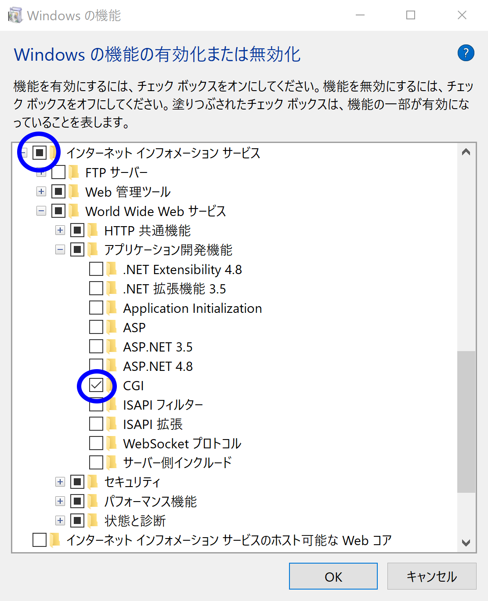
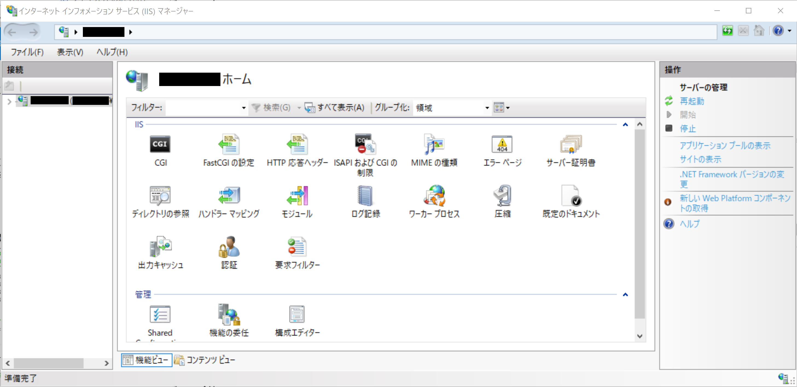
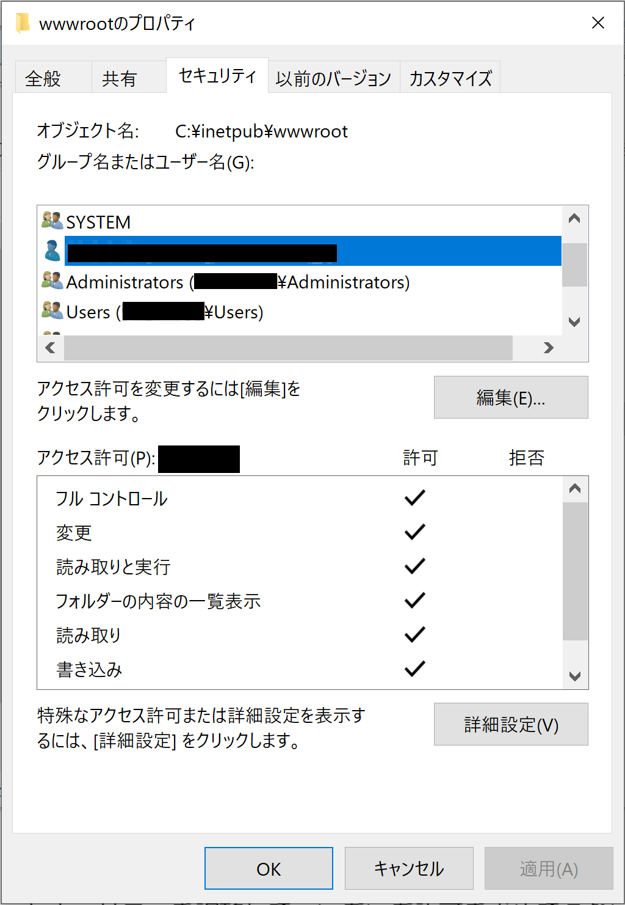
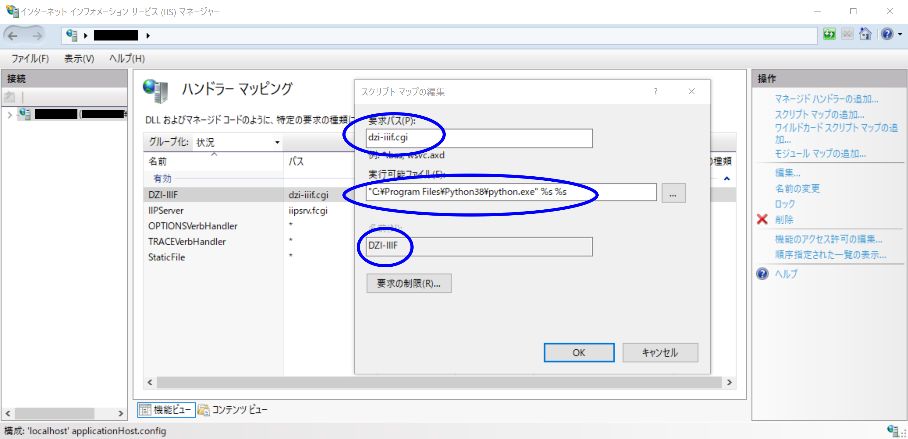
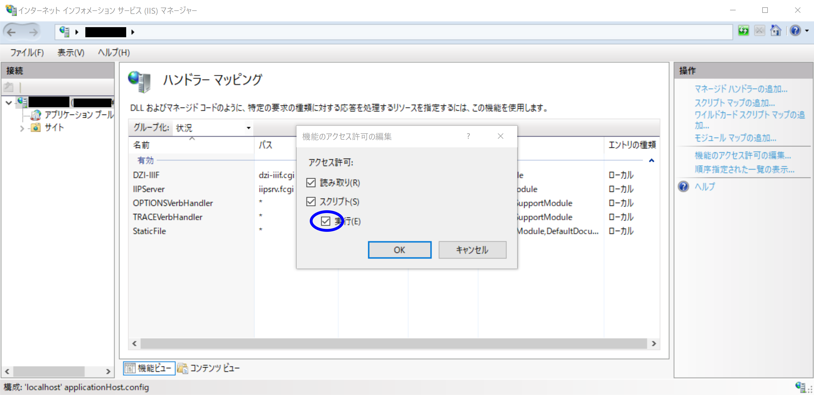
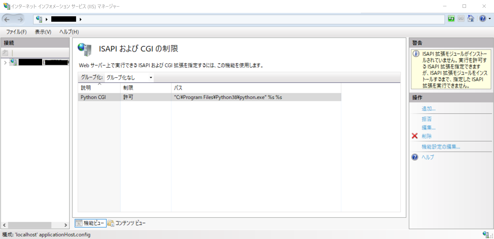
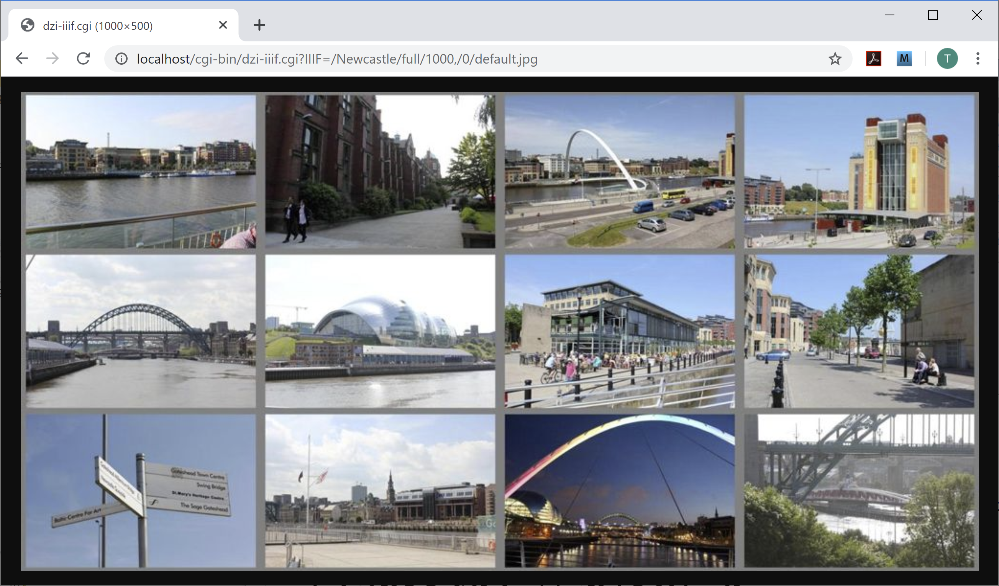

# [DZI-IIIF](https://github.com/nmjhsuzuki/DZI-IIIF)

# 特徴 (Features)

　[DZI-IIIF](https://github.com/nmjhsuzuki/DZI-IIIF)は，Deep Zoom 形式(DZI)画像を IIIF Image API に沿って呼び出せるようにするための Web CGI です．画像リクエストと画像情報リクエストの双方に対応しています．Python3 で書かれています．現在はレベル１準拠です．

　[DZI-IIIF](https://github.com/nmjhsuzuki/DZI-IIIF) is a Web CGI for giving IIIF Image API Interface to Deep Zoom images (DZI). Both of image request and image information request are acceptable. It is written in Python3. It has IIIF Image API Compliance Level 1.

# デモンストレーション (Demonstration)

　Newcastle という名前の Deep Zoom 画像を取得してみます．12枚のスナップ写真を並べたものです．

　画像リクエスト(1)：画像全体を横1000ドットに縮小して取得する．  
　　[http://nmjhsuzuki.xii.jp/cgi-bin/dzi-iiif.cgi?IIIF=/Newcastle/full/1000,/0/default.jpg](http://nmjhsuzuki.xii.jp/cgi-bin/dzi-iiif.cgi?IIIF=/Newcastle/full/1000,/0/default.jpg)

　画像リクエスト(2)：２行目の左から２枚目の写真を，横1000ドットに縮小して取得する．  
　　[http://nmjhsuzuki.xii.jp/cgi-bin/dzi-iiif.cgi?IIIF=/Newcastle/5508,3672,5184,3456/1000,/0/default.jpg](http://nmjhsuzuki.xii.jp/cgi-bin/dzi-iiif.cgi?IIIF=/Newcastle/5508,3672,5184,3456/1000,/0/default.jpg)  
（Tyne 川のほとりにあるコンサート会場 [Sage Gateshead](https://sagegateshead.com/) の写真．）

　画像情報リクエスト：オリジナルの画像サイズが21600x10800画素であることがわかる．  
　　[http://nmjhsuzuki.xii.jp/cgi-bin/dzi-iiif.cgi?IIIF=/Newcastle/info.json](http://nmjhsuzuki.xii.jp/cgi-bin/dzi-iiif.cgi?IIIF=/Newcastle/info.json)

　Apache のリダイレクション機能を使って，cgi呼び出しを見せないようにすることもできます．  
　　[http://nmjhsuzuki.xii.jp/dzi/Newcastle/full/1000,/0/default.jpg](http://nmjhsuzuki.xii.jp/dzi/Newcastle/full/1000,/0/default.jpg)  
　　[http://nmjhsuzuki.xii.jp/dzi/Newcastle/5508,3672,5184,3456/1000,/0/default.jpg](http://nmjhsuzuki.xii.jp/dzi/Newcastle/5508,3672,5184,3456/1000,/0/default.jpg)  
　　[http://nmjhsuzuki.xii.jp/dzi/Newcastle/info.json](http://nmjhsuzuki.xii.jp/dzi/Newcastle/info.json) 

# 背景 (Background)

　[IIIF (International Image Interoperability Framework)](https://iiif.io) は，画像へのアクセスを標準化し相互運用性を確保するための国際的なコミュニティ活動です([Wikipedia](https://ja.wikipedia.org/wiki/International_Image_Interoperability_Framework)より)．画像へのアクセス方法は [IIIF Image API](https://iiif.io/api/image/2.1/) によって規定されています．  
　[Deep Zoom](https://en.wikipedia.org/wiki/Deep_Zoom) は，Microsoft が開発した，任意の大きさの画像を取り扱える画像技術の一つです．現在では，[Openseadragon](https://openseadragon.github.io) を用いて，PC・タブレット・スマートフォン等の Web ブラウザ上に画像を表示することができます．  
　私が勤める[国立歴史民俗博物館（歴博）](https://www.rekihaku.ac.jp) では，屏風や絵巻などの一辺が数万～数十万画素に及ぶ画像を，どこでも任意の倍率で表示する超大画像ビューワを2000年に開発し，常設展示・企画展示等で来館者の利用に供してきました．2016年ごろから Openseadragon を用いたビューワへ移行し，画像の保持形式として Deep Zoom 形式を用いています．  
　歴博の資料画像をより多くの方々に使っていただくためには，IIIFへの対応が不可欠と考えていますが，Deep Zoom 形式を取り扱える IIIF 画像サーバがなぜか見つけられませんでした．ならば，ということで，Python の勉強を兼ねて作ってみました．  

# 必要な環境 (Requirement)

　Python3 が必要です．Pillow も必要なので pip install Pillow しておいてください．  
　Web サーバに CGI として登録して，呼び出して使います．  

　Windows10 Professional 64bit（バージョン1909）上で，以下の環境でテストしています．

* IIS 10.0.18362.1
* Python 3.8.3 (64bit版)
* Pillow 7.1.2

　さくらのレンタルサーバースタンダード(FreeBSD 9.1-RELEASE-p24 amd64)上で，以下の環境でテストしています．

* Apache 2.4.43
* Python 3.5.9
* Pillow 7.1.2

# インストール(Installation)

* [Windows10(+IIS)へのインストール](#windows10iisへのインストール)
* [さくらのレンタルサーバへのインストール](#さくらのレンタルサーバへのインストール)

## Windows10(+IIS)へのインストール

　Windows10 PC 上でIISを用いてローカルでテストすることを想定しています．

### (1) IIS をインストールする

　インストールは，スタートメニューから「歯車アイコン（設定）---アプリ---アプリと機能---（末尾までスクロール）---プログラムと機能」を選び，左側にある「Windowsの機能の有効化または無効化」を呼び出します．「インターネットインフォーメーションサービス」にチェックを入れ，＋を押してサブツリーを開き，「World Wide Web サービス---アプリケーション開発機能---CGI」にもチェックを入れます(図1)．「Ok」を押すとインストールが始まります．

　  
　図1 「Windowsの機能の有効化または無効化」における設定

　インストールが成功すると，スタートメニューから「Windows管理ツール---インターネット インフォーメーション サービス (IIS) マネージャー」で管理プログラムを呼び出せるようになります(図2)．

　  
　図2 「インターネット インフォーメーション サービス (IIS) マネージャー」の起動時画面

　デフォルトでは WWW のルートディレクトリは C:\inetpub\wwwroot になります．セキュリティを調整して，いちいち許可を求めてこないようにしておくとよいでしょう(図3)．

　  
　図3 セキュリティ調整の例　自分にフルコントロールを与える

### (2) git clone する

以下のコマンドで，C:\DZI-IIIF 以下にファイルが展開されます．

```Batchfile
C:\>git clone https://github.com/nmjhsuzuki/DZI-IIIF.git
```

### (3) images フォルダにDZIファイルを置く

[DZICONV](https://github.com/nmjhsuzuki/DZICONV)を使って，サンプルとなるDZIファイル"Newcastle"を作ることができます．ここでは D:\ にDZICONVを git clone します．

```Batchfile
D:\>git clone https://github.com/nmjhsuzuki/DZICONV.git
...
D:\DZICONV>python dziconv.py .\input\Newcastle\index.csv .\output
...
D:\DZICONV>robocopy .\output\Newcastle C:\DZI-IIIF\images\Newcastle /S
```

### (4) cgi-binフォルダをWWWルートにコピー

```Batchfile
C:\DZI-IIIF>robocopy .\cgi-bin C:\inetpub\wwwroot\cgi-bin /S
```

### (5) dzi-iiif.cgiを編集する

git clone したフォルダ名を C:\DZI-IIIF から変えていなければ，とくに変更は必要ないはずです．

```Python
...
# --- 利用者環境に応じて設定する情報 ここから ---

# 画像情報リクエストで返す基底URI
uri = 'http://localhost/cgi-bin/dzi-iiif.cgi?IIIF='

# 各種ディレクトリの設定
import os
if (os.name == 'nt'): # Windows
    lpath = os.path.join('C:'+os.sep, 'DZI-IIIF')
    spath = os.path.join(lpath, 'scripts') # pythonスクリプトディレクトリへのパス
    dpath = os.path.join(lpath, 'images') # データディレクトリへのパス
    lpath = os.path.join(lpath, 'logs') # ログディレクトリへのパス
else: # Mac or Linux
# マシン単位のインストールサンプル
#    spath = os.path.join(os.sep, 'usr', 'local' 'DZI-IIIF', 'scripts') # pythonスクリプトディレクトリへのパス
#    dpath = os.path.join(os.sep, 'var', 'DZI-IIIF', 'images') # データディレクトリへのパス
#    lpath = os.path.join(os.sep, 'var', 'log', 'DZI-IIIF') # ログディレクトリへのパス
# 個人アカウント単位のインストールサンプル
    lpath = os.path.join(os.path.expanduser('~user'), 'DZI-IIIF')
    spath = os.path.join(lpath, 'scripts') # pythonスクリプトディレクトリへのパス
    dpath = os.path.join(lpath, 'images') # データディレクトリへのパス
    lpath = os.path.join(lpath, 'logs') # ログディレクトリへのパス
#fi

# 作成する画像の一辺のピクセル値の上限
whmax = 2000

# デバッグモードを設定
dbg = False
#dbg = True

# --- 利用者環境に応じて設定する情報 ここまで ---
...
```

### (6) dzi-iiif.cgiをIISのcgiとして登録する

　図2の管理プログラムを起動し，「ハンドラーマッピング」を選びます．右側の「操作」メニューから「スクリプトマップの追加」を選び，図4のように打ちこんで「Ok」を押し，dzi-iiif.cgi をCGI登録します．  
　  
　図4 「スクリプトマップの追加」で dzi-iiif.cgi をCGI登録する

　ついで，「機能のアクセス許可の編集」を選び，「実行」のところをチェックして(図5)「Ok」を押して確定してください．これでCGIの登録が有効になります．  
　  
　図5 「機能のアクセス許可の編集」で，CGIを有効にする．

　図2の画面に戻って，「ISAPIおよびCGIの制限」を選び，CGIが登録されていることを確認します(図6)．「説明」の部分は最初「（説明なし）」になっていますが動作には支障ありません．左側の操作メニューから「編集」を選んで，説明を書きこむことができます．  
　  
　図6 「ISAPIおよびCGIの制限」で，CGIの登録を確認する．

### (7) うまく動くかテストする

　Webブラウザで [http://localhost/cgi-bin/dzi-iiif.cgi?IIIF=/Newcastle/full/1000,/0/default.jpg](http://localhost/cgi-bin/dzi-iiif.cgi?IIIF=/Newcastle/full/1000,/0/default.jpg) にアクセスし，画像が表示されれば成功です．  

　  
　図7 dzi-iiif.cgiの動作テスト

## さくらのレンタルサーバへのインストール

　Unix/Linux 系統のOSならインストールはほぼ同様の手順になると思います．  
　ここでは，サーバ名 nmjhsuzuki.xii.jp，ユーザ名 nmjhsuzuki，ホームディレクトリ /home/nmjhsuzuki とします．  
　また，さくらのレンタルサーバではpython3がインストールされていないため，ここでは ~/python にインストールしてあるものとします．  

### (1) git clone する

　ここでは，ホームディレクトリに DZI-IIIF を展開するものとします．

```Tcsh
/home/nmjhsuzuki% git clone https://github.com/nmjhsuzuki/DZI-IIIF.git
```

### (2) images フォルダにDZIファイルを置く

　[DZICONV](https://github.com/nmjhsuzuki/DZICONV)を使って，サンプルとなるDZIファイル"Newcastle"を作ることができます．  
　DZICONVもホームディレクトリに git clone するものとします．サンプルの画像データが同梱されていますので，DZI画像を作ってみましょう．  
　※./input/Newcastle/index.csv 内のパス区切り文字の変更をお忘れなく！

```Batchfile
/home/nmjhsuzuki% git clone https://github.com/nmjhsuzuki/DZICONV.git
...
/home/nmjhsuzuki% cd DZICONV
...(注意: ./input/Newcastle/index.csv 内のパス区切り文字を \ から /  に書き換えること)...
/home/nmjhsuzuki/DZICONV% python3 dziconv.py ./input/Newcastle/index.csv ./output
...
/home/nmjhsuzuki/DZICONV% cp -R ./output/Newcastle ~/DZI-IIIF/images/Newcastle
```

### (3) cgi-binフォルダをWWWルートにコピー

　さくらのレンタルサーバでは WWW ルートディレクトリは ~/www がデフォルトです．

```Tcsh
/home/nmjhsuzuki/DZI-IIIF% cp -R ./cgi-bin ~/www/cgi-bin
```

### (4) dzi-iiif.cgiを編集する

　１行目の python3 へのパスを正確に指定してください．  
　基底URIの書き換えが必要なので注意してください．とくに Apache のリダイレクションを用いる場合などは，リダイレクション前の基底URIになるように設定してください．

```Python
#!/home/nmjhsuzuki/python/bin/python3
...
# --- 利用者環境に応じて設定する情報 ここから ---

# 画像情報リクエストで返す基底URI
#
#uri = 'http://localhost/cgi-bin/dzi-iiif.cgi?IIIF='
uri = 'http://nmjhsuzuki.xii.jp/cgi-bin/dzi-iiif.cgi?IIIF='
#uri = 'http://nmjhsuzuki.xii.jp/dzi'

# 各種ディレクトリの設定
import os
if (os.name == 'nt'): # Windows
    lpath = os.path.join('C:'+os.sep, 'DZI-IIIF')
    spath = os.path.join(lpath, 'scripts') # pythonスクリプトディレクトリへのパス
    dpath = os.path.join(lpath, 'images') # データディレクトリへのパス
    lpath = os.path.join(lpath, 'logs') # ログディレクトリへのパス
else: # Mac or Linux
# マシン単位のインストールサンプル
#    spath = os.path.join(os.sep, 'usr', 'local' 'DZI-IIIF', 'scripts') # pythonスクリプトディレクトリへのパス
#    dpath = os.path.join(os.sep, 'var', 'DZI-IIIF', 'images') # データディレクトリへのパス
#    lpath = os.path.join(os.sep, 'var', 'log', 'DZI-IIIF') # ログディレクトリへのパス
# 個人アカウント単位のインストールサンプル
#    lpath = os.path.join(os.path.expanduser('~user'), 'DZI-IIIF')
    lpath = os.path.join(os.path.expanduser('~nmjhsuzuki'), 'DZI-IIIF')
    spath = os.path.join(lpath, 'scripts') # pythonスクリプトディレクトリへのパス
    dpath = os.path.join(lpath, 'images') # データディレクトリへのパス
    lpath = os.path.join(lpath, 'logs') # ログディレクトリへのパス
#fi

# 作成する画像の一辺のピクセル値の上限
whmax = 2000

# デバッグモードを設定
dbg = False
#dbg = True

# --- 利用者環境に応じて設定する情報 ここまで ---
...
```

### (5) dzi-iiif.cgi を実行可能ファイルに設定する

```Tcsh
/home/nmjhsuzuki/www/cgi-bin:% chmod a+x dzi-iiif.cgi
```

### (6) うまく動くかテストする

　Webブラウザで [http://nmjhsuzuki.xii.jp/cgi-bin/dzi-iiif.cgi?IIIF=/Newcastle/full/1000,/0/default.jpg](http://nmjhsuzuki.xii.jp/cgi-bin/dzi-iiif.cgi?IIIF=/Newcastle/full/1000,/0/default.jpg) にアクセスし，画像が表示されれば成功です．  

# その他 (Note)

　最初のバージョンを 2020年6月1日に公開しました．  
　レベル２準拠への対応まで行なう予定です．

# 作者情報 (Author)

* 鈴木卓治 (SUZUKI, Takuzi)
* 国立歴史民俗博物館 (National Museum of Japanese History, Chiba, JAPAN)
* Email: suzuki@rekihaku.ac.jp
* Twitter: @digirekiten （デジタルで楽しむ歴史資料 https://twitter.com/digirekiten ）

# ライセンス (License)

　"DZI-IIIF"は[MIT license](https://en.wikipedia.org/wiki/MIT_License)に従います．

　"DZI-IIIF" is under [MIT license](https://en.wikipedia.org/wiki/MIT_License).

